# Expenses Reimbursement System
## Project Description
The Expense Reimbursement System will manage the process of reimbursing employees for expenses incurred while on company time. All employees in the company can login and submit requests for reimbursement and view their past tickets and pending requests. Finance managers can log in and view all reimbursement requests and past history for all employees in the company. Finance managers are authorized to approve and deny requests for expense reimbursement.
## Technologies Used
* IntelliJ
* DBeaver
* Visual Studio Code
* Amazon AWS
* TomCat
## Features
* Register as an Employee or Finance Manager and receive an email with your login credientials
* Employees can submit reimbursement requests and view their past tickets
* Finance managers can log in and view all pending and resolved reimbursement requests of all the employees
* All passwords are encrytped in the database
* Finance managers are authorized to approve and deny requests for expense reimbursement
* To reorganize the different reimbursement requests you can just click on the table headings, you can do this with the headings: resolved date, status, submitted date, amount and reimbursement id

To-do list:
* Add a feature that will allow employees to submite an image of a receipt
* Add a feature that allows FInance managers to view the image of the receipt of the reimbursement request

## Getting Started
* Install DBeaver and link your Amazon AWS Database
* Install TomCat
* Download the project and open it with Intelliji
* Once The project is open, add a TomCat configuration
* Given any name to the configuration in the Name: section as you can see in the image tomcat.png
* Then in Tomcat Server select the option thats in the image tomcat.png
* Set the Server port to 9000
* Set the Admin port to 9005 
* Add the pathing of the webapp folder to the Deployment Directory by clicking the folder image beside it as you can see in the tomcat.png
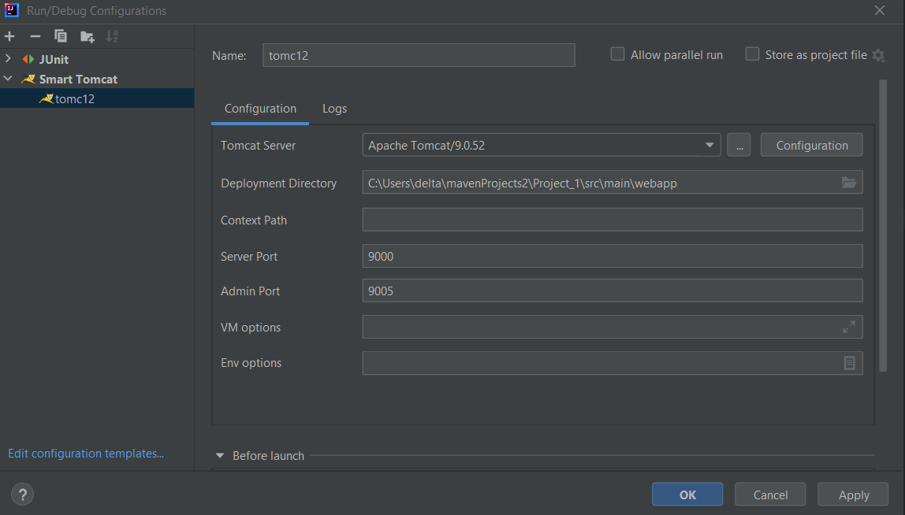 

* Next go to DBeaver and create a new database with the name reimbursement_db
* Open a script in that database and run the code that can be seen in the sqlscript.png image (ctrl+enter after each ;)
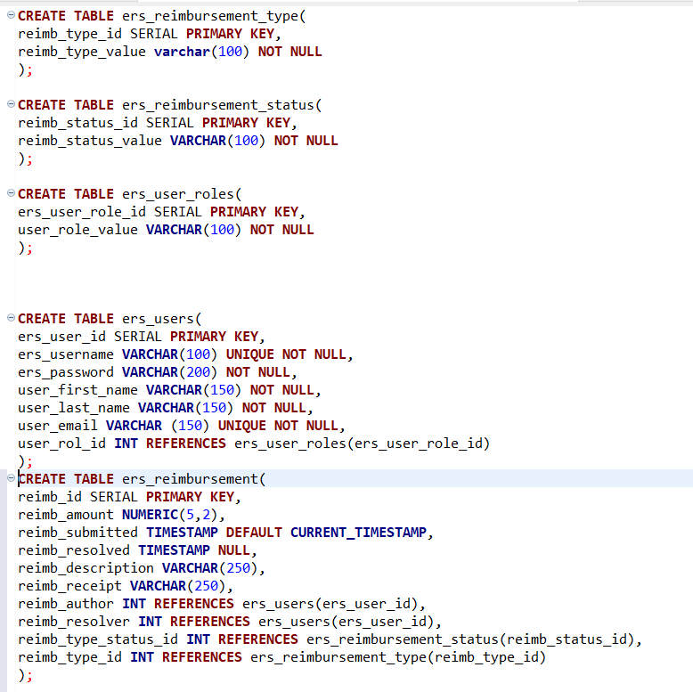 

* After you run the script you should have the following tables that are in image tables.png
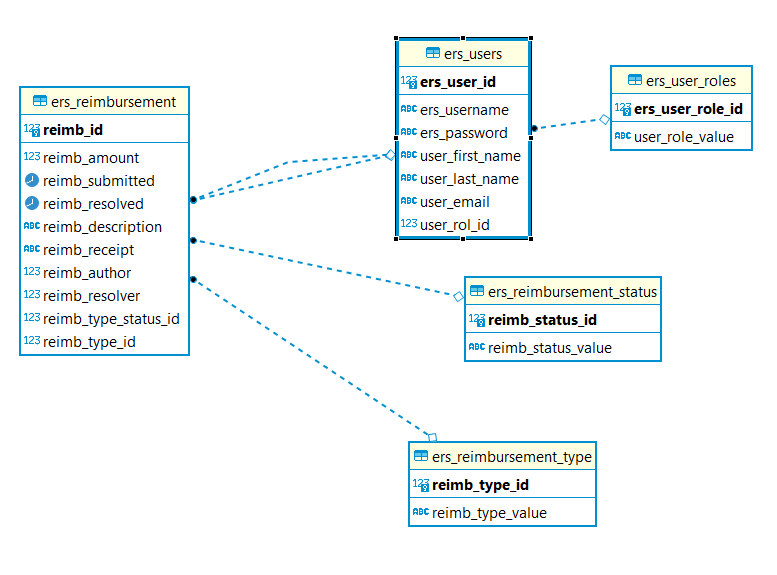 

* Next go to the file location that you can see in EditConnection.PNG image
* Once there you are going to need to add your Amazon AWS database connection information here
* In the url variable you are going to add your database url and /database name, in the variable username your are going to add your username and lastly add your password to the password variable 
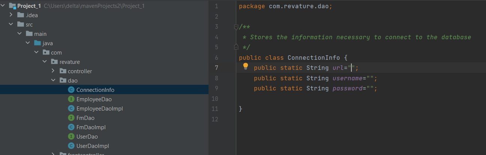 

* Once that is set up select the tomCat configuration and hit the run button to run the application (you can see which button to press in the runApp.png image)

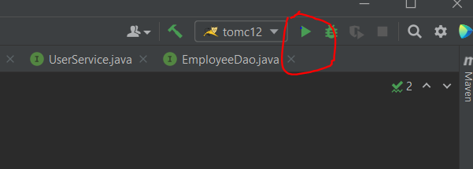 

The go to your web browser and type: http://localhost:9000/ and it should take you to the start of the programm as you can see in the start.png image
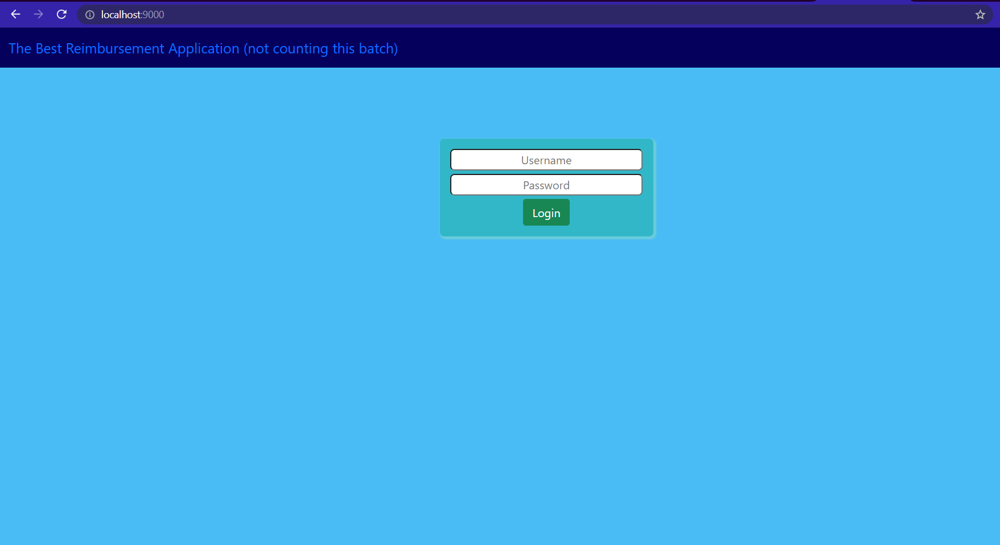

## Usage
* The program starts when you run the programm and go to the web browser and type http://localhost:9000/. This will take you to the begin of the prgramm (you can see it in the start.png image)
* When you login as a Employee it will take you to the Employee menu (you can see it in the Employ.png image) where you can see all of your pending and resolved reimbursement requests. If you want to change accounts jsut click the red logout button and it will take you to the login page (start.png). 

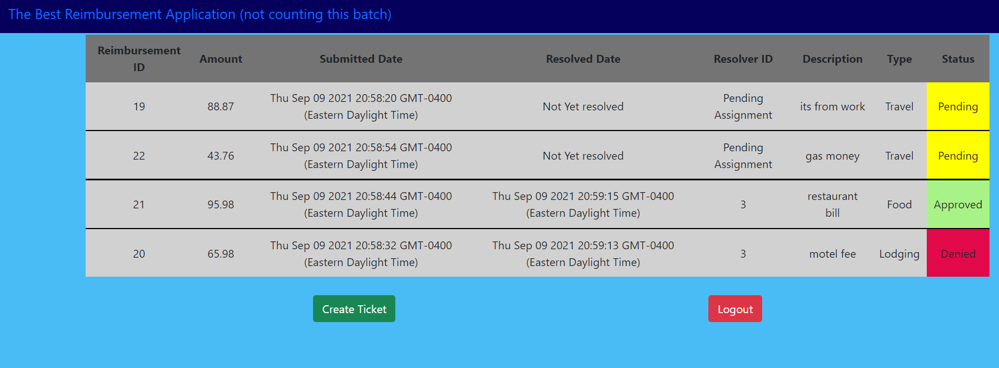 
* You can also create a reimbursement ticket by clicking the green create a ticket button, and it will take you to the create a ticket menu (you can see it in the create.png image). Just add the data you want your ticket to contain and click the create (green) button to send the reimbursement request. 

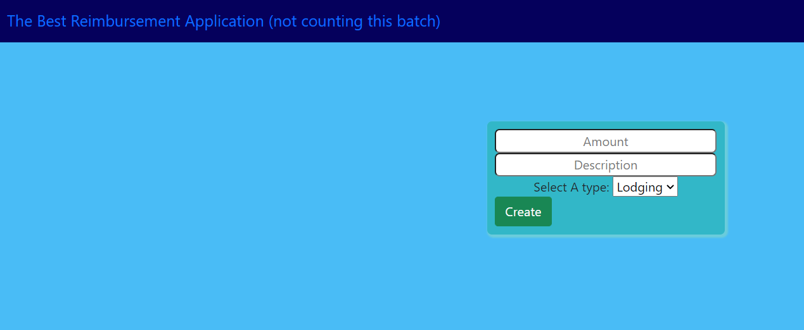

* When you login in as a Finance Manager it will take you to the Finance Manager menu (you can see it in the manager.png image), in this menu you can see all of the resolved and pending request from all of the Employees. To aprove or deny a request you just need to click either the approve or deny button.

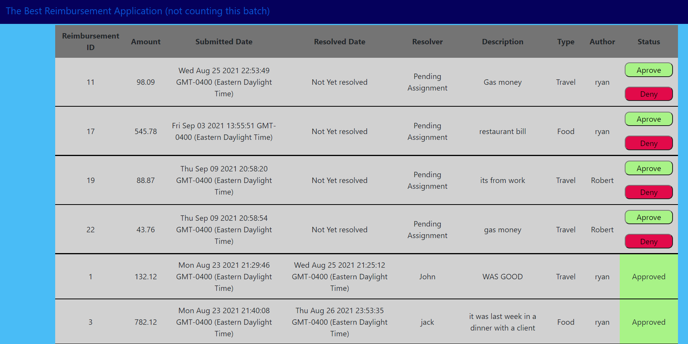

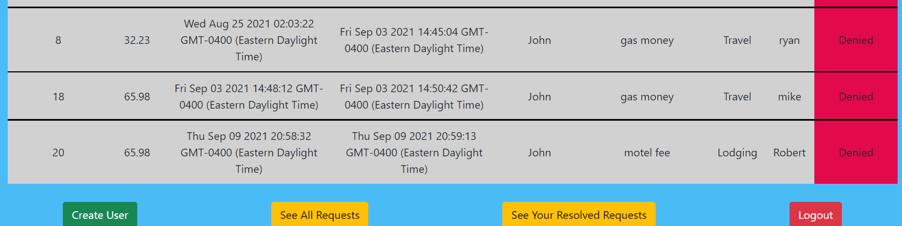
* To create a user just scroll down until you see the differents buttons (operations.png image) and click the create user green button. This will take you to the create user menu where you can create a user (newUser.png image).
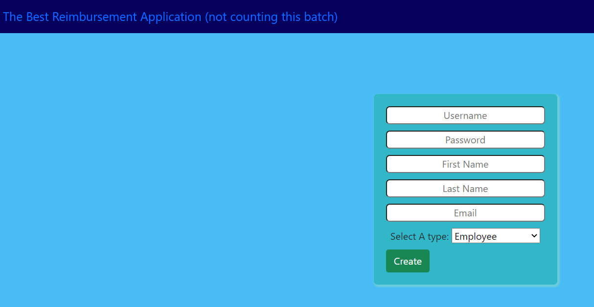

* To see your own resolved reimbursement requests you can click on the see your reimbursement request yellow button and it will take you to the menu from the yourrequest.png image. In this menu you can either see your resolved requests or denied requests by click the red or green button

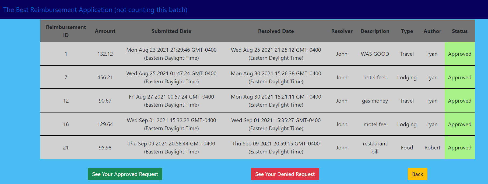

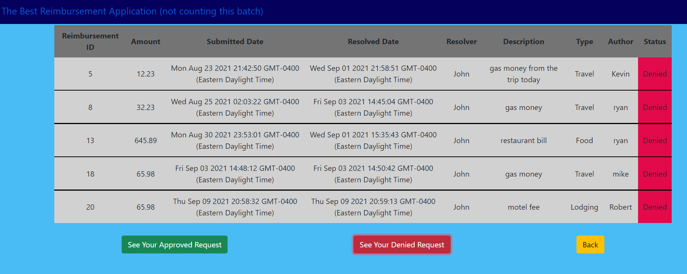

